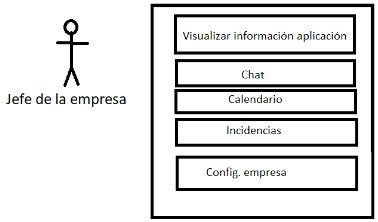

# LUME
## Living Urban Management Experience


### Índice de contenidos
* [Introducción y Justificación](#introducción-y-justificación)
    * [Introducción](#introducción)
    * [Objetivos](#objetivos)
* [Tecnologías escogidas](#tecnologías-escogidas)
    * [Tecnologías escogidas y justificación](#tecnologías-escogidas-y-justificación)
    * [Motor de base de datos](#motor-de-base-de-datos)
    * [Framework seleccionado](#framework-seleccionado)
* [Diseño de la aplicación](#diseño-de-la-aplicación)
    * [Casos de uso](#casos-de-uso)
    * [Modelo de dominio](#modelo-de-dominio)
* [Arquitectura de la aplicación](#arquitectura-de-la-aplicación)
    * [Estructura del proyecto](#estructura-del-proyecto)
    * [Recursos externos](#recursos-externos)
* [Manual](#manual)
    * [Pre-requisitos](#pre-requisitos)
    * [Instalación](#instalación)
    * [Iniciar aplicación](#iniciar-aplicación)
* [Metodología](#metodología)
* [Conclusiones](#conclusiones)
    * [Mejoras](#mejoras)
    * [Dificultades](#dificultades)


### Introducción y Justificación
#### Introducción

**LUME (Living Urban Management Experience)** es una aplicación web la cual tiene como finalidad ayudar a los usuarios de las comunidades vecinales con su gestión, ofreciendo diferentes funcionalidades, como gestión financiera, gestión de incidencias o la creación de eventos. También ayuda a la administración de comunidades vecinales, proporcionando soporte tanto a los administradores (en caso de que los haya), como a los residentes. Su objetivo principal es mejorar la experiencia dentro de las comunidades, aliviando a los residentes de preocupaciones innecesarias. 


#### Objetivos
La razón por la cual se ha desarrollado una aplicación web de este campo,  nace a raíz de los diversos problemas que hay actualmente con la gestión de comunidades vecinales. Dado que hoy muchos usuarios les surge la necesidad de usar varias aplicaciones con la finalidad de poder cumplir con las diversas necesidades. Con la introducción de esta aplicación en las comunidades se obtendrá múltiples beneficios tales como una mayor gestión económica de los datos de los usuarios y las comunidades, una mayor posibilidad de relacionarse con otros usuarios, una total transparencia…

### Tecnologías escogidas
La aplicación dará servicios a distintos tipos de usuarios;

* **Anónimo:** Podrán acceder a la página de visitas, donde dentro podrán conocer los distintos servicios que ofrecemos.
* **Usuario:** Podrán acceder a la aplicación, donde en función de su rol tendrán acceso a una serie de servicios u otros. Los roles serán:
    * **Presidente/Vicepresidente:** tendrán acceso a diversas funcionalidades en las cuales les permitirá una gestión más completa de sus comunidades.
    * **Usuario:** tendrán acceso a menos funcionalidades comparado con el presidente y solo podrán leer las diversas informaciones acerca de la comunidad.
    * **Trabajador interno:** Los trabajadores internos de las comunidades podrán ver los diversos campos base como el calendario o el chat y tendrán acceso al apartado de incidencias con algunas limitaciones.
    * **Jefe de una empresa:** Los jefes de las empresas podrán visualizar el mismo contenido que los trabajadores internos, pero estos podrán interactuar con su empresa (pudiendo modificar sus datos, trabajadores…)
    * **Trabajador de una empresa:** Por último los trabajadores verán exactamente lo mismo que los trabajadores internos, pero tendrán más limitaciones a la hora de interactuar con una incidencia.
* **Administrador (LUME):** También contiene el permiso administrador, para todos aquellos trabajadores de LUME, los cuales tendrán acceso total a la aplicación y podrán ver, editar o incluso eliminar cualquier datos que aparezca.

#### Tecnologías escogidas y justificación

La aplicación ha sido desarrollada en su mayor parte haciendo uso del lenguaje de programación [**Python**](https://www.python.org/). No obstante, también se ha utilizado otros lenguajes para poder realizar las diversas funciones esperadas, como el lenguaje cliente [**JavaScript**](https://developer.mozilla.org/es/docs/Web/JavaScript) y su biblioteca multiplataforma [**Jquery**](https://jquery.com/).

#### Motor de base de datos
El motor de base de datos utilizado para el desarrollo de esta aplicación ha sido [**SQLite**](https://www.sqlite.org/), dado que es el motor con el cual se suele desarrollar en [**Django**](https://www.djangoproject.com/). También tiene una serie de motivos por las cuales he decidido mantener este motor:

- Su adquisición es gratuita.
- Es multiplataforma para Windows, Linux y Mac (los sistemas operativos más extendidos) con lo cual se podrá disponer de él en cualquiera de estos.
- La labor de mantenimiento de una base de datos SQLite es muy fácil debido a que presenta menos funciones frente a otros sistemas gestores. Esto, aunque pueda parecer una desventaja, tiene a su favor que el mantenimiento de la aplicación lo puede llevar el propio desarrollador, sin tener que recurrir a un administrador de bases de datos.
- Es escalable, lo cual nos da una ventaja con vistas al futuro.
- Django ofrece una serie de funcionalidades las cuales permiten ahorrar tiempo en su desarrollo.

#### Framework seleccionado
El framework usado es [**Django**](https://www.djangoproject.com/) 5.0.4. Las razones de su elección son:

- Es un framework de Python, lo cual me es muy ventajoso para mi, dado que es el lenguaje de programación principal con el que más cómodo me siento programando.
- Es un framework gratuito.
- Django incorpora el modelo de Modelo-Vista-Template, el cual me permite insertar elementos Python de una forma más rápida y sencilla dentro del HTML.
- La comunidad de desarrolladores Django es muy amplia. Permitiendo consultar foros o funciones ya desarrolladas y probadas las cuales he podido añadir al código de forma sencilla y que me ha ahorrado tener que crearlos y probarlos por mi mismo.
- Buena comunicación entre el back-end y el front-end.

### Diseño de la aplicación
Como se explicó en el apartado [Tecnologías escogidas](#tecnologías-escogidas), esta aplicación está diseñada y pensada para 6 distintos casos de uso. Cada caso de uso tiene una serie de funciones posibles para realizar, que se podrá apreciar mejor en las siguientes imágenes:

#### Casos de uso


##### USUARIO


##### Trabajador Comunidad


##### Trabajador Empresa


##### Jefe de la empresa


##### Usuario Comunidad


##### Presidente / Vicepresidente


##### Administrador


#### Modelo de dominio


### Arquitectura de la aplicación
#### Estructura del proyecto
La estructura de la aplicación es la siguiente:
- [**APP:**](./app/) carpeta donde se ubica el contenido de la aplicación, vistas y archivos
    - [**Admin_lume:**](./app/admin_lume/) contiene todas las funciones relacionadas con los administradores de la aplicación.
    - [**Authentication:**](./app/authentication/) contiene el sistema de login, register y recuperación de contraseña.
    - [**Home:**](./app/home/) contiene las funciones de la aplicación, también se ubica el modelo y los distintos formularios.
    - [**Static:**](./app/static/) ubicación donde se almacenan los archivos de estilo (CSS), almacena las imágenes y los scripts (JS).
    - [**Templates:**](./app/templates/) almacena las diferentes plantillas HTML las cuales mostrará a los usuarios.
- [**CORE:**](./core/) contiene la configuración del proyecto
- [**LOCALE:**](./locale/) ubicación donde se encuentran las diferentes traducciones.
- **VENV:** contiene el entorno de desarrollo
- [**DB.SQLITE3:**](./db.sqlite3) archivo con información (base de datos)
- [**MANAGE.PY:**](./manage.py) archivo de ejecución, para iniciar la aplicación.
- [**REQUIREMENTS.TXT:**](./requeriments.txt) archivo con requisitos para el funcionamiento de la aplicación.

#### Recursos externos
En esta aplicación se han usado diversos recursos externos, es decir, librerías y código no escrito por el desarrollador de esta aplicación. Los recursos externos usados son:

- [**Bootstrap 5:**](https://getbootstrap.com/docs/5.0/getting-started/introduction/) para el aspecto visual de la aplicación.
- [**Jquery:**](https://jquery.com/) librería de Javascript.

### Manual
#### Pre-requisitos

```
- GIT
- Python3
- Pip
- asgiref (3.8.1)
- certifi (2024.2.2)
- charset-normalizer (3.3.2)
- Django (5.0.4)
- django-taggit (5.0.1)
- idna (3.7)
- pillow (10.3.0)
- polib (1.2.0)
- requests (2.32.2)
- sqlparse (0.5.0)
- tzdata (2024.1)
- urllib3 (2.2.1)
```

#### Instalación
Primero de todo tendremos que descargar el proyecto y entrar en la carpeta principal, posteriormente tendremos que tener todas nuestras dependencias. Para poder usar la aplicación, se recomienda usar [**venv**](https://docs.python.org/es/3.8/library/venv.html) para la instalación de todas las dependencias usadas en el proyecto.

Para ello, tendremos que ejecutar el siguiente comando dentro de la carpeta de nuestro proyecto:

```
python -m venv venv
```

Después tendremos que instalar los requisitos de [requeriments.txt](./requeriments.txt), posteriormente de haber activado el entorno virtual:

```
python -r requeriments.txt
```

#### Iniciar aplicación
Una vez tengamos todo el entorno preparado, procederemos a arrancar la aplicación, para ello tendremos que lanzar el siguiente comando en la terminal:

```
python manage.py runserver
```


### Metodología


Para realizar este proyecto he utilizado una [**metodología Espiral**](https://www2.deloitte.com/es/es/pages/technology/articles/que-es-el-desarrollo-en-espiral.html), primero de todo cree un prototipo donde iba visualizando diferentes aspectos base, después cuando ya conseguí que esa base fuera estable y tenía ya generado unas funciones de los objetivos principales, pase a dividir el trabajo (tanto la parte de diseño como la lógica) en diferentes etapas.

Al ser un proyecto individual, no pude implementar la metodología Scrum internamente, pero si la pude aplicar con el resto de compañeros o usuarios donde iba obteniendo algún feedback, gracias a eso me permitió poder modificar la aplicación siempre buscando el objetivo de ser intuitivo y eficaz.

### Conclusiones
En general, haber realizado este proyecto final de grado, me ha permitido aprender muchas cosas, desde frameworks que desconocía , hasta implementar códigos o librerías que me han permitido poder llegar a cumplir todo lo esperado. También he podido aprender a base de errores, muchas otras cosas que me ayudaran a tener en cuenta para ahorrar tiempo hasta incluso dinero.

A pesar de haber elegido un tema el cual a medida que iba desarrollando o diseñando veía que cada vez era más extenso, estoy bastante satisfecho con los resultados obtenidos. La aplicación ha cumplido con todos y cada uno de los requisitos mínimos que esperaba tener e incluso me ha podido permitir añadir algunas cosas a modo extras.

#### Mejoras
Aunque el proyecto haya terminado y haya cumplido con todos los requisitos que esperaba, me han surgido diferentes ideas de mejoras las cuales me habría gustado poder implementar:

- Implementar un sistema de calendario grupal para la comunidad donde se gestione la limpieza de la comunidad en caso de ser una limpieza realizada por los usuarios.
- Implementar un sistema de gestión de plazas de parking.
- Añadir un mapa en el cual permitiera ver los diferentes eventos de las comunidades cercanas, con la finalidad de poder obtener de una forma visual la ubicación del evento.
- Y también añadir un mapa para visualizar las ubicaciones de las empresas, de cara a la gestión de incidencias saber donde se ubica cada empresa y poder tomar una decisión sobre a quién asignar una incidencia de una forma más visual.

#### Dificultades

También cabe destacar que se ha encontrado con varias dificultades a la hora de desarrollar la aplicación, pero la principal barrera con la que me he encontrado ha sido el tiempo, dado que al querer cumplir con tantas funcionalidades base, he tenido que aplicar muchas horas para que se cumpliera.